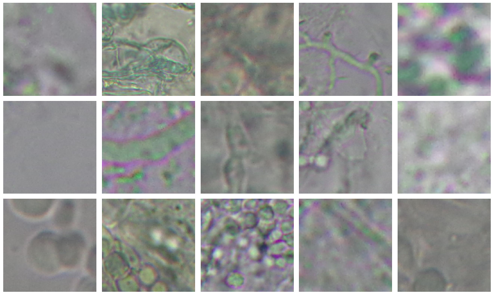

# DeFungi Image Classification Project

## Overview

This Jupyter Notebook provides a comprehensive overview of the DeFungi Image Classification Project, aiming to develop a robust machine learning model for classifying microscopic fungi images. The project utilizes the DeFungi dataset, comprising 9114 cropped microscopic images classified into five categories: H1, H2, H3, H5, and H6. The notebook covers various aspects of machine learning, including data preprocessing, exploratory data analysis, and the implementation and evaluation of multiple deep learning models. The ultimate goal is to achieve precise and efficient image classification in a medical context.

## Contents

1. **Set-up and Cleaning Data**
   - Import Libraries: Essential libraries like TensorFlow and ImageDataGenerator are imported.
   - Data Inspection: Checking for corrupt files and assessing image quality, including readability and brightness checks.

2. **Data Cleaning**
   - Image Processing: Activities such as aspect ratio normalization and blurriness checks are performed. Images are enhanced for better visibility using OpenCV and Pillow.

3. **Data Transformation**
   - Resizing Images: Images are resized to a standard dimension for uniformity, crucial for CNN model input.
   - Normalizing Pixel Values: Pixel values are scaled down to a [0, 1] range for better model performance.

4. **Exploratory Data Analysis (EDA)**
   - Visual Inspection of Images: A sample of images is visually inspected for better understanding, utilizing matplotlib and ImageDataGenerator.
   - Label Distribution Analysis: Analyzing the distribution of various classes to identify class imbalances.
   - Pixel Intensity Analysis: Insights into contrast and brightness across the dataset, impacting image quality.
   - Data Visualization: Techniques like average image computation are employed for deeper insights into the dataset.

5. **Modeling**
   - Dataset Splitting: The dataset is divided into training, testing, and validation sets.
   - Baseline Model - MLP: A Multi-Layer Perceptron model is built as a baseline, with images reshaped into 1D vectors for MLP input.
   - Model II - CNN: A Convolutional Neural Network is implemented for its suitability for image data, including Conv2D, MaxPooling2D, Flatten, and Dense layers.
   - Model III - MobileNetV2: Utilizing transfer learning with the MobileNetV2 architecture for efficient image classification.
   - Model IV - EfficientNetB0: Addressing computational efficiency to reduce training time.
   - Model V - ResNet101: Introducing ResNet101 to tackle the vanishing gradient problem in deep networks.
   - Final Model - VGG16: Testing VGG16 for its effectiveness in image classification.

6. **Results and Interpretation**
   - Performance assessment of each model based on accuracy metrics. Challenges like long training times and computational constraints are encountered.

7. **Error Handling and Debugging**
   - Error handling for various stages like image loading and model training, ensuring smooth execution and debugging.

## Conclusion

This project exemplifies a rigorous approach to solving a complex image classification problem in the medical domain. Through various machine learning models and techniques, it provides insights into the effective classification of microscopic fungi images, contributing significantly to medical research and diagnostics.
